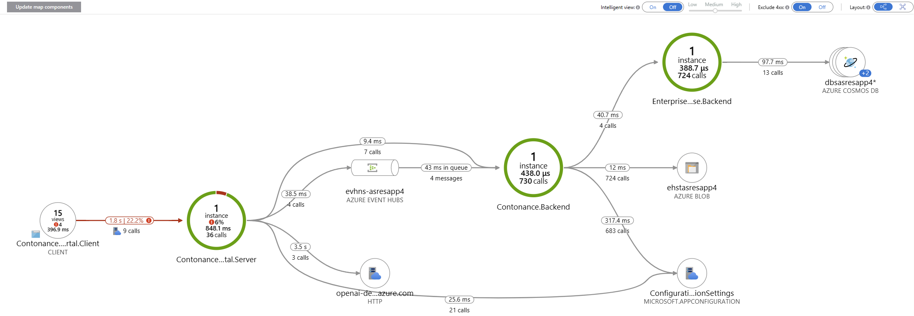
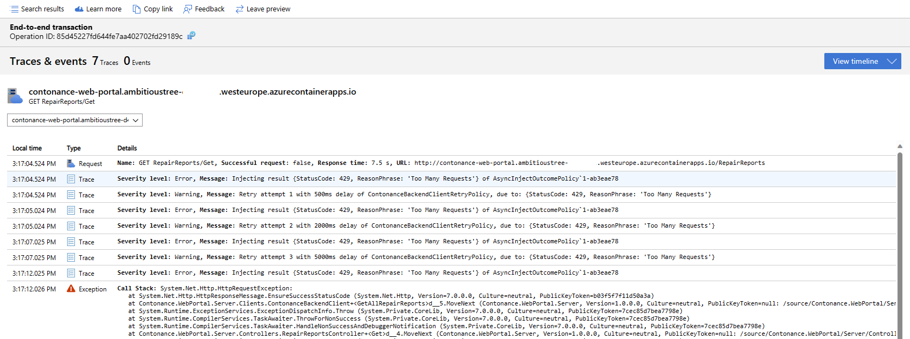

# Building resilient applications in Azure

Chaos engineering, fault injection testing, resiliency patterns, designing for failure - so many design principles and topics and still is reliability often times an afterthought.  
Let us run together a "game day" for resilience validation of our sample Azure application: **Contonance - Awesome Ship Maintenance, a subsidary of Contoso Group**.  

Take a look how we use **Azure App Configuration** to toggle various resilience scenarios, and how we measure, understand, and improve resilience against real-world incidents using **resiliency patterns and fault injections in code**.
We will also show you how you can use **Azure Monitor with Application Insights** to compare and understand the availability impact of your patterns.

> [!NOTE]
> This sample was also presented at the **Microsoft Azure Solution Summit at 27./28. September**

## High Level Architecture


## Deploy Azure resources

e.g. possible reagions:  
'westcentralus,eastus,westus,centralus,uksouth,westeurope,japaneast,northcentralus,eastus2'

```bash
PROJECT_NAME="asresapp1"
LOCATION="westeurope"
GITHUB_REPO_OWNER="jplck"
IMAGE_TAG="latest"

bash ./deploy-infra.sh $PROJECT_NAME $LOCATION $GITHUB_REPO_OWNER $IMAGE_TAG
```

## Create config file

```bash
PROJECT_NAME="asresapp1"

bash ./create-config.sh $PROJECT_NAME
```

## Launch locally

- create azure resources by running infra script
- create local config by running create config script or adjust environment variables in local.env accordingly
- launch debug and open [Contonance WebPortal at https://localhost:7217](https://localhost:7217)

## Resiliency patterns shown in this sample

- [**Queue-Based Load Leveling**](https://docs.microsoft.com/en-us/azure/architecture/patterns/queue-based-load-leveling)  
  Use a queue that acts as a buffer between a task and a service that it invokes, to smooth intermittent heavy loads
- [**Throttling**](https://docs.microsoft.com/en-us/azure/architecture/patterns/throttling)  
  Control the consumption of resources by an instance of an application, an individual tenant, or an entire service
- [**Rate Limiting**](https://learn.microsoft.com/en-us/azure/architecture/patterns/rate-limiting-pattern)  
  Avoid or minimize throttling errors related to throttling limits and to more accurately predict throughput
- [**Circuit Breaker**](https://docs.microsoft.com/en-us/azure/architecture/patterns/circuit-breaker)  
  Handle faults that might take a variable amount of time to fix when connecting to a remote service or resource
- [**Retry**](https://docs.microsoft.com/en-us/azure/architecture/patterns/retry)  
  Enable an application to handle anticipated, temporary failures when it tries to connect to a service or network resource by transparently retrying an operation that's previously failed
- [**Fault Injections**](https://azure.microsoft.com/en-us/blog/advancing-resilience-through-chaos-engineering-and-fault-injection/)  
  Validating that systems will perform as designed in the face of failures is possible only by subjecting them to those failures. Fault injecting  services before they go to production, e.g. with service-specific load stress and failures

## Walkthrough

1. Open the *Contonance WebPortal*, show all three pages, recognize that **everything executes without errors**
2. Show the [architecture diagram](architecture.drawio.svg)
3. Show *Azure Application Insights Application Map*
   
4. Show source code of [WebPortal.Server Program.cs L23](src/Contonance.WebPortal/Server/Program.cs#L23), explain how `AddAzureAppConfiguration` uses **settings push model** and no restarts are required
5. Show source code of [WebPortal.Server ContonanceBackendClient.cs L28](src/Contonance.WebPortal/Server/Clients/ContonanceBackendClient.cs#L28), explain **configuration of the patterns** `Retry` and `CircuitBreaker` and the **order** of them in the pipeline of `HttpClient`
6. Open *Azure App Configuration Feature manager* UI, enable `Contonance.WebPortal.Server:InjectRateLimitingFaults`
7. Show *Contonance WebPortal Repair Tasks* and how it **crashes**
8. Open *Azure App Configuration Feature manager* UI, enable `Contonance.WebPortal.Server:EnableRetryPolicy`
   
9. Show *Contonance WebPortal Repair Tasks* and try until it **crashes**, explain added **retry latency** and shown **Correlation ID**
10. Show source code of [WebPortal.Server ContonanceBackendClient.cs L50](src/Contonance.WebPortal/Server/Clients/ContonanceBackendClient.cs#L50) and explain the **injection machanisms**
11. Show *Azure Application Insights Transaction search*, show **end-to-end transaction details** and how the `Retry` and `InjectResult` is visible
    
